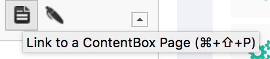
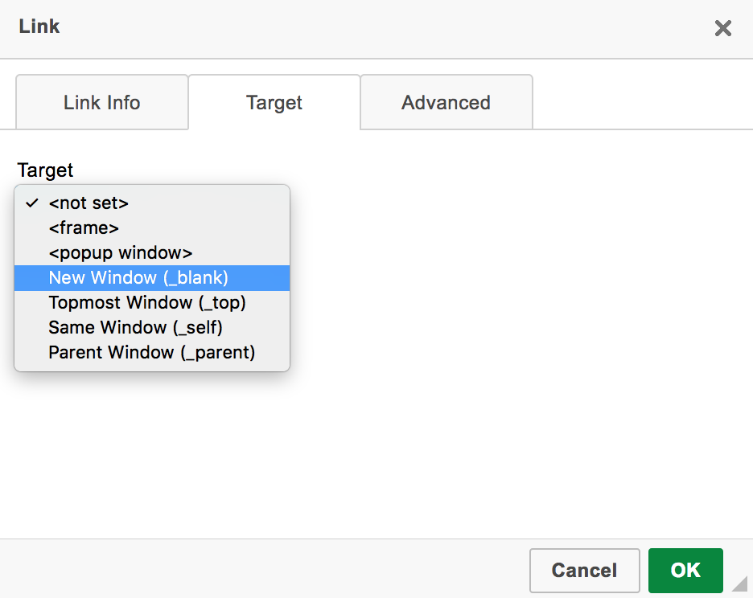
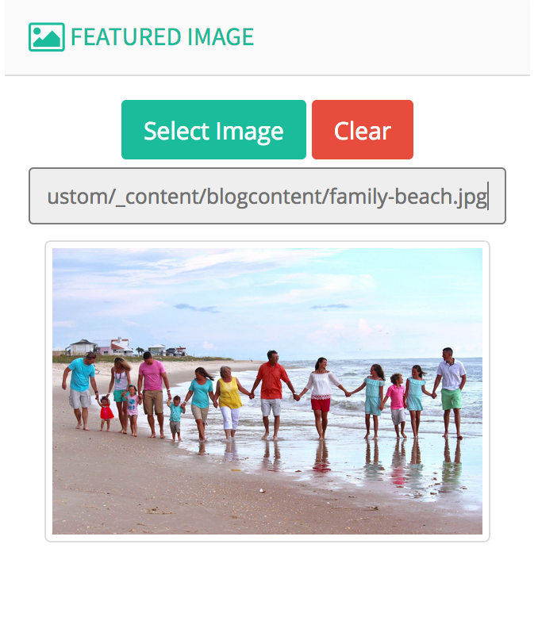
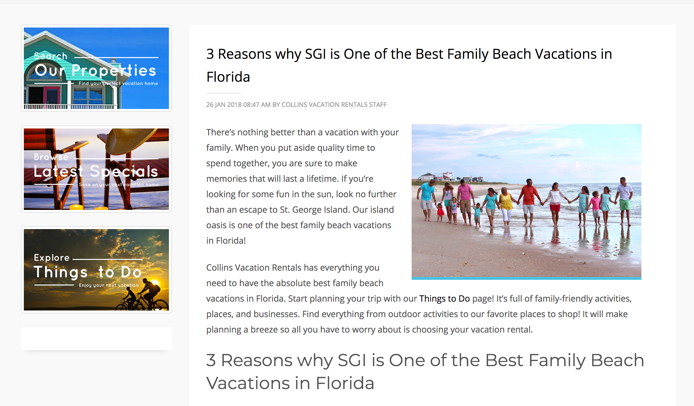

# Blog Posts

## Internal Links

Instead of linking to the URL of the internal page such as `/my-new-page` or `http://www.mywebsite.com/my-new-page` choose an approach that not cause your content to die should the page be renamed, or the domain name changed, etc.  

To do so, you use **Link to ContentBox Page** 



The resulting HTML will look like this inside the code editor:

```text
<a href="page:[my-new-page]" title="My New Page">My New Page</a>
```

However, it will be rendered like this when the page is generated and more importantly, how the search engines will see it.

```text
<a href="http://www.mywebsite.com/my-new-page" title="My New Page">My New Page</a>
```

### But Why?

If the owner of the website changes the domain name, page slug or anything of the such ALL of these links will be updated and there will not be any broken links within your blog posts!

## External Links

This is simple, have all external links open with `target="_blank"`



### But Why?

My clients are my \#1 priority and I completely understand the need to link to external websites, I feel the viewer should not completely lose the visibility of my clients website that they have worked so hard to gain.

## Featured Images

In the sidebar you simple select the featured image you wish to upload and add it there, that's it.  There's no need to include it in the body of the content to have it displayed where the theme designer would like for it to be.  This may change as the website changes, so do not hardcode inline images into the content of the blog post that are right aligned with inline CSS, etc.  _**NOTE:** If you find yourself doing this, you need to contact the website developer._



### Image Upload Locations

Be kind to those who have to maintain not only the blog, but the website too. Use a convention for all of your images that are used for blogging.  For my clients we have created a folder called `blogcontent` that all images should be uploaded to.  From there you can organize according to YOUR needs.

### Image File Names

I HIGHLY recommend using all lowercase images with dashes instead of spaces in the filenames.  It may work the day you upload the image, but not all servers handle spaces in filenames the same.  Besides, it's much easier on the eyes.

**Do This:** family-beach.jpg  
**NOT This:** Family Beach.JPG

### But Why?

Look at the auto-generated magic! The featured image was automatically inserted where the designer of the website felt it would look best as well as have the ability to apply the necessary styling of the images.




## Categories

Proper categories **must be selected** for each blog post, the client should specify which categories they choose to utilize.  These categories will be be visible in the sidebar to help readers find content as well as search engines.

### But Why?

That's what we've decided to do.


